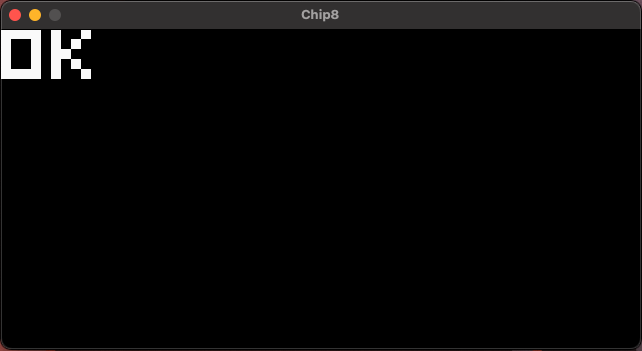
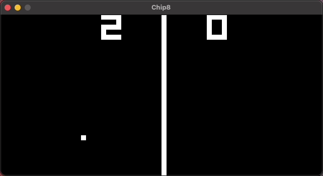

# chip8
A w.i.p chip8 interpreter written in Python <br />
Reference - http://devernay.free.fr/hacks/chip8/C8TECH10.HTM#2.2

## Installation
Keep in mind the steps below assume you are using `python >= 3.6`
```bash
cd chip8/
pip install virtualenv
python -m venv venv/
source venv/bin/activate
pip install -r requirements.txt
```

## Usage
```bash
cd emulator/
python3 emulate.py <ROM PATH>
```

## Run tests
I've included some tests for applicable opcodes in `unit_tests/` which you can run by doing:
```bash
cd unit_tests/
chmod +x run_unit_tests.sh
./run_unit_tests.sh
```

## Examples
**Test ROM** (courtesy of [@metteo](https://github.com/metteo/chip8-test-rom))\
\


<br/>

**Pong**\
\


Controls:
- `1` and `4` control the left paddle
- `z` and `x` control the right paddle
- `BACKSPACE` quits the emulator
